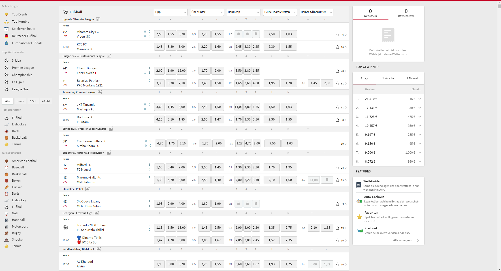
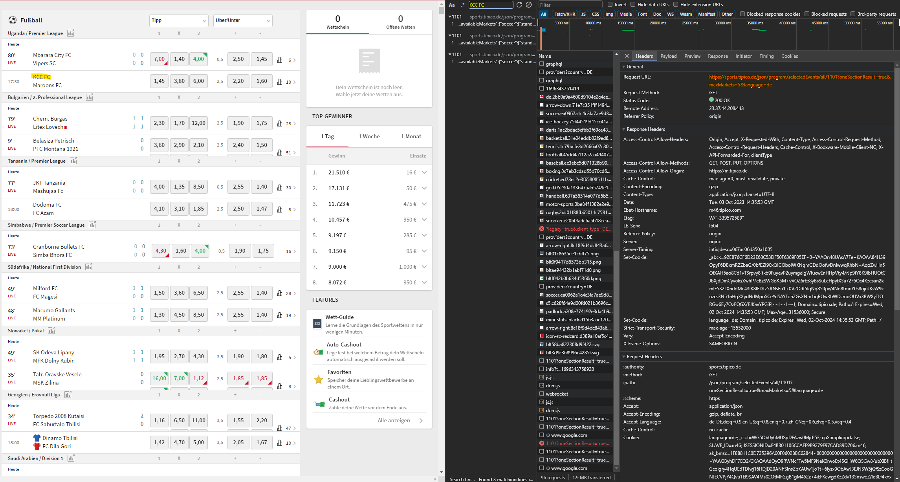

## Exploring the Tipico Website

First, let's take a look at the structure of the Tipico website. It has four categories: "All," "Today," "3 Hours," and "48 Hours." However, from the website itself, we can't list all the matches for a specific sport. Instead, we can list all matches for a particular league within that sport. This leads us to the URL structure, which looks like this:

```https://sports.tipico.de/de/alle/fussball/deutschland/3-liga```

But what if we remove unnecessary details like "deutschland" and "3-liga"? Doing so gives us this link:

```https://sports.tipico.de/de/alle/fussball/```

Voila! The website now lists all football matches. You can also limit the number of matches displayed using time parameters.



## Scraping Data

How do we scrape the data? The first idea is to use Selenium, a framework for automating web browser interactions. However, Selenium loads all JavaScript and CSS, which can slow down the scraping process. So, let's try a different method: using a GET request to obtain the data. The advantage over Selenium is that we receive only raw data without loading CSS or JavaScript. To find the GET request, we need to open the Developer Tools and filter for Fetch/XHR in the network tab. Using the search function (Ctrl+F) to find a match listed, we locate the GET request.



We attempt to create a GET request on the URL without headers to see if Tipico blocks it, and we discover that we don't need cookies or other parameters to obtain raw data. Jackpot!

Now, let's look at the parameters in the URL:

oneSectionResult: Displays matches for the user interface, showing only one section.
maxMarkets: Specifies the number of markets shown for a match.
language: Sets the language.
For testing purposes, we'll remove all three parameters:

```https://sports.tipico.de/json/program/selectedEvents/all/1101```

But what does "1101" mean? We previously chose football as the sport. Let's try selecting a different sport, like basketball. Now a different GET request is sent: 

```https://sports.tipico.de/json/program/selectedEvents/all/2101```

Only the first digit has changed! From this, we can create a table:

| sportype   | id |
|------------|----|
| football   | 1  |
| basketball | 2  |
| icehockey  | 4  |
| tennis     | 5  |
| handball   | 6  |
| rugby      | 12 |

## Data Structure

What we receive is a JSON file. The JSON file structure, focusing on the essential attributes, looks like this:

```SELECTION/
├── ...
├── events/
│   ├── "580284510"/
│   │   ├── ...
│   │   ├── "team1"
│   │   ├── "team2"
│   │   └── ...
│   └── ...
├── ...
├── matchOddGroups/
│   ├── "580284510"/
│   │   ├── "standard"
│   │   ├── "double-chance"
│   │   ├── "handicap"
│   │   └── ...
│   └── ...
└── ...
```

Each match has a unique ID, in this case, "580284510." In the "events" section, you can find the names of the teams, while the "matchOddGroups" section provides details on different types of bets for each match.