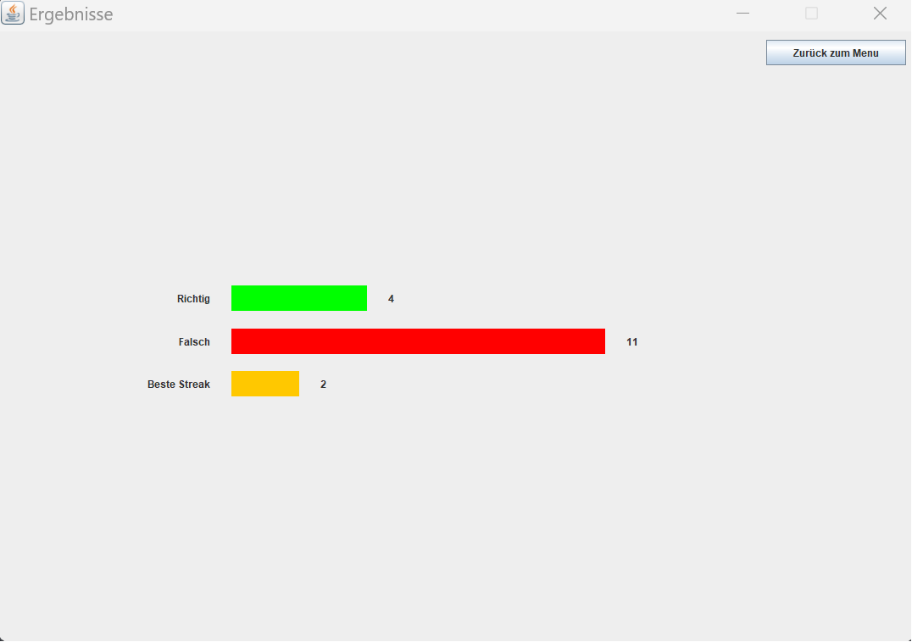
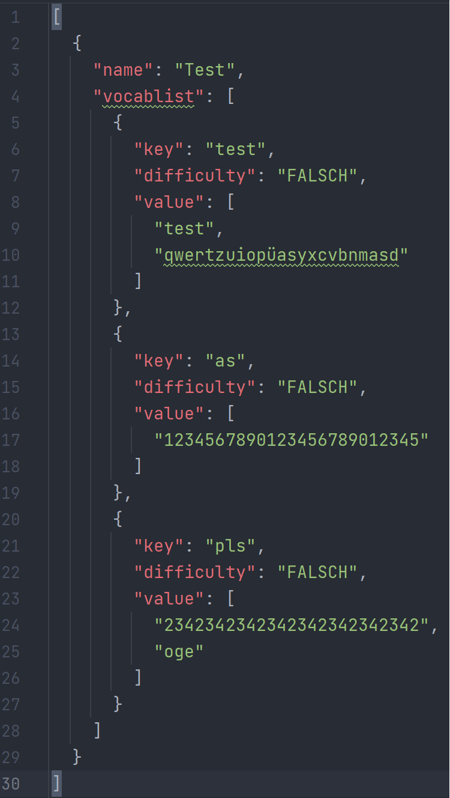

Today, I'm excited to present my school project, the Vocabulary Test App. This project is a testament to my IT skills and creativity, showcasing a practical tool for vocabulary learning. Let's explore its key features:

## User-Friendly Interface
The app features a user-friendly main menu where you can easily create and delete flashcards. Multiple pages are available to organize a large vocabulary collection, and a search function simplifies flashcard retrieval.

Main Menu GIF (Coming Soon)

## Flashcard Customization
In ```editing mode```, you can customize your flashcards by adding, editing, or deleting them. A convenient table on the right side of the window keeps track of your vocabulary entries, and returning to the main menu is seamless.

Edit Mode GIF (Coming Soon)

## Study Mode
Toggle the ```exam mode switch``` to enter study mode, where you can interact with your flashcards, test your memory, and improve your vocabulary skills.

Study Mode GIF (Coming Soon)

## Adaptive Learning
In ```exam mode```, flashcards adapt their difficulty levels based on your performance. Three challenge levels (```Easy```, ```Medium```, and ```Hard```) are available, and the exam comprises 15 questions. A ```Streak``` counter motivates you at the bottom right of the window.

Exam Mode GIF (Coming Soon)

## Insightful Results
After completing the 15 questions, your progress is visually displayed in a bar chart. This chart highlights your highest streak and the number of correctly and incorrectly answered flashcards.



## Data Security:
To ensure data preservation, the Vocabulary Test App automatically saves flashcards to a file, so your hard work and progress won't be lost.



## Conclusion
In conclusion, my Vocabulary Test App is a practical demonstration of my IT skills and problem-solving abilities. It's designed to simplify vocabulary learning and offers a user-friendly experience. Whether you're a student or a teacher, this project serves as an example of my commitment to developing useful applications for real-world needs.